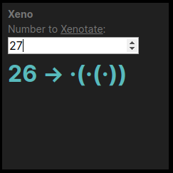

#   Xenotation Tile for Urbit Landscape

Convert a number from a decimal representation to an [implexed tic xenotation](http://hyperstition.abstractdynamics.org/archives/003538.html).

    npm run build

then in your dojo

    |commit %home
    |start %xeno

Due to the way JS updates fields, the number you have visible in the form is the _next_ number which will be calculated, not the current calculation.

